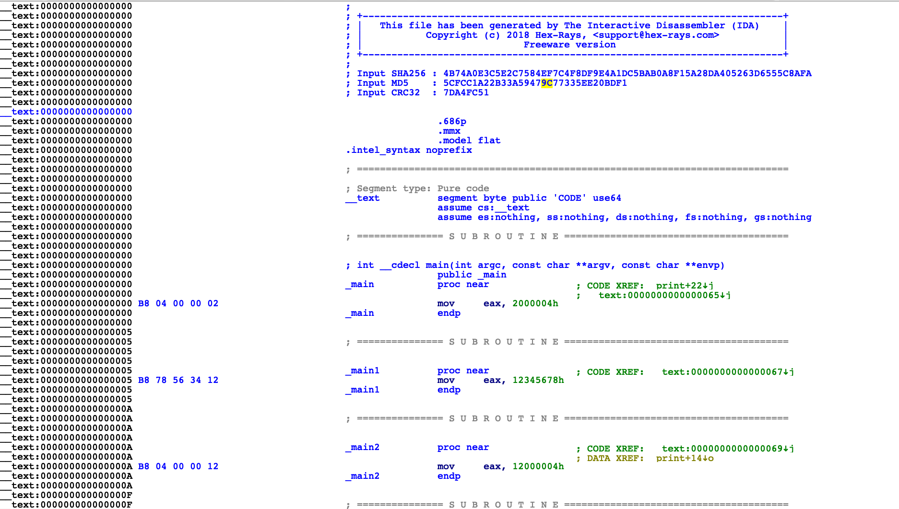
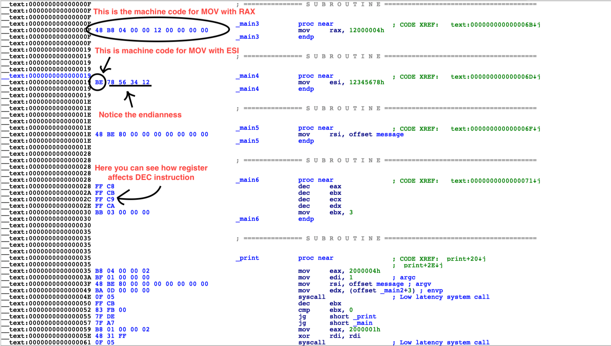
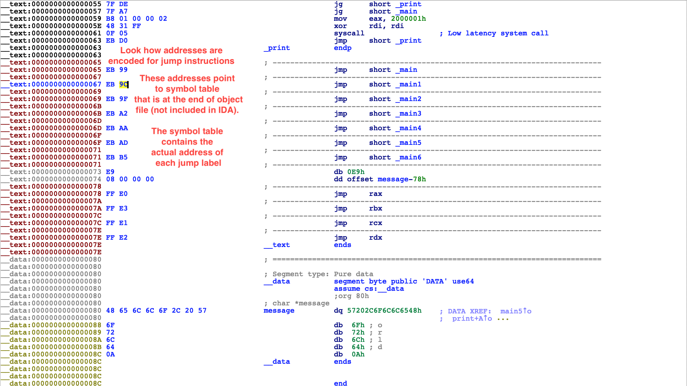
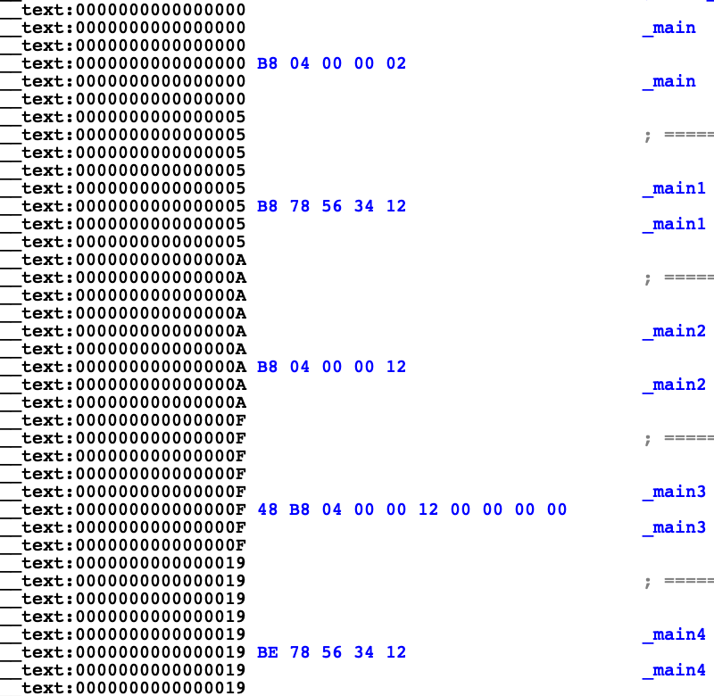
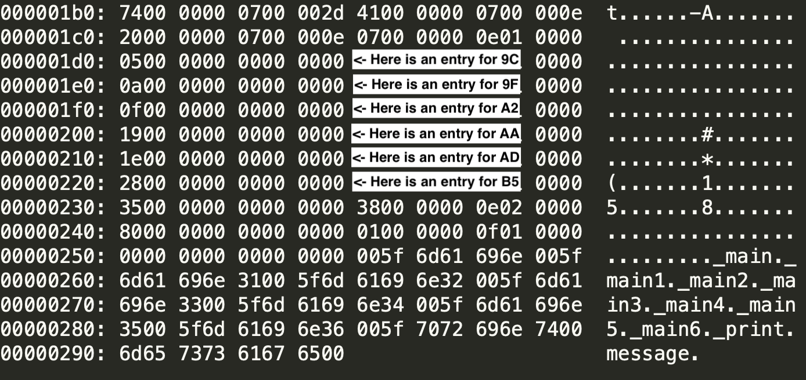

# Compiler tutorial | Low-level series 

## Part 1 - How to make your own assembler


The task of assembler is to produce object files. Here you can find useful command and examples that will help you with learning the insides of assembler. The architecture used is Intel x64 on macOS, however, the skills presented here are universal.

I prepared 3 exampels of assembly code: `ex1.asm`, `ex2.asm`, `ex3.ams`. Each one is a slightly more complex version of the previous.

Command used for compiling (uses `ex1.asm` and produces `ex1.o`):

```
nasm -fmacho64 ex1.asm
```

Command used for linking

```
ld -lSystem -macosx_version_min 10.10 -o ex1 ex1.o 
```

It produces an executable which can be ran as follows:

```
./ex1
```
After running it, you should see
```
Hello, World
```
The `ex2.asm` adds jump instruction and prints this message 3 times in a loop.

```
$ ./ex2
Hello, World
Hello, World
Hello, World
```
The `ex3.asm` works the same as `ex2.asm` but it additionally includes plenty of redundant code that you can lookup in IDA and see the corresponding machine code for each instruction. Many of them have been duplicated with only a slight variation in operands. This way you can quickly see how the machine code differs depending on used registers, relative/absolute adresses and other parameters.





Take a look at the jump addresses. For instance `jmp _main1` translates to `EB 9C`. The `EB` is the opcode of `jmp`. The `9C` is an address in symbol table. If you run

```
xxd ex3.o
```

you will see this

```
... BUNCH OF CODE HERE ....
000001c0: 2000 0000 0700 000e 0700 0000 0e01 0000   ...............
000001d0: 0500 0000 0000 0000 0e00 0000 0e01 0000  ................
000001e0: 0a00 0000 0000 0000 1500 0000 0e01 0000  ................
000001f0: 0f00 0000 0000 0000 1c00 0000 0e01 0000  ................
00000200: 1900 0000 0000 0000 2300 0000 0e01 0000  ........#.......
00000210: 1e00 0000 0000 0000 2a00 0000 0e01 0000  ........*.......
00000220: 2800 0000 0000 0000 3100 0000 0e01 0000  (.......1.......
00000230: 3500 0000 0000 0000 3800 0000 0e02 0000  5.......8.......
00000240: 8000 0000 0000 0000 0100 0000 0f01 0000  ................
00000250: 0000 0000 0000 0000 005f 6d61 696e 005f  ........._main._
00000260: 6d61 696e 3100 5f6d 6169 6e32 005f 6d61  main1._main2._ma
00000270: 696e 3300 5f6d 6169 6e34 005f 6d61 696e  in3._main4._main
00000280: 3500 5f6d 6169 6e36 005f 7072 696e 7400  5._main6._print.
00000290: 6d65 7373 6167 6500                      message.
```

(I included the full hex dump in `object_file_dump_ex3.txt`)

This part shows you exactly the symbol table. We can look it up in a more human-readable way using `nm` command

```
$ nm ex3.o 
0000000000000000 T _main
0000000000000005 t _main1
000000000000000a t _main2
000000000000000f t _main3
0000000000000019 t _main4
000000000000001e t _main5
0000000000000028 t _main6
0000000000000035 t _print
0000000000000080 d message
```

Notice how these addresses perfectly correspond to the ones we can see in IDA



Now you can easily see that addresses of jumps corresponds to entries in symbol table:


